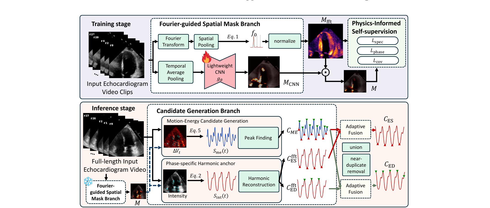
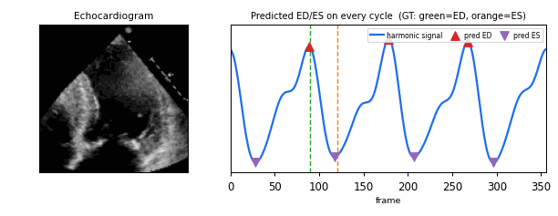

<div align="center">

# CardiacPULSE

**Frequency-Aware Self-Supervised Cardiac Phase Detection in Echocardiography** (MICCAI 2026)

<a href="LICENSE"></a>




</div>

CardiacPULSE detects end-diastole (ED) and end-systole (ES) frames in echocardiography **without labels, ECG, or segmentation**. A lightweight CNN learns a Fourier-guided spatial mask with self-supervised frequency-domain losses, and ED/ES frames are decoded from the resulting per-frame cardiac signals.

<div align="center"></div>

## Results

**EchoNet-Dynamic (A4C)**, MAE in ms:

| Method | Supervised | ED | ES | Avg |
|:--|:--:|:--:|:--:|:--:|
| R3D-50 | ✓ | 40.2 | 32.6 | 36.4 |
| MAEF | ✓ | 44.5 | 46.1 | 45.3 |
| UVT | ✓ | 139.2 | 65.0 | 102.1 |
| RepNet | ✗ | 97.1 | 135.5 | 116.3 |
| DDSB | ✗ | 83.4 | 175.4 | 129.4 |
| CardiacPhase | ✗ | 58.3 | 39.8 | 49.0 |
| **CardiacPULSE** | ✗ | **34.4** | **33.6** | **34.0** |

**CAMEO (9 views, macro-average)**: CardiacPULSE 41.2 ms vs. CardiacPhase 182.4 ms.

## Installation

```bash
git clone https://github.com/xmed-lab/CardiacPulse.git && cd CardiacPulse
conda create -n cardiacpulse python=3.10 && conda activate cardiacpulse
pip install torch==2.5.1 torchvision==0.20.1 --index-url https://download.pytorch.org/whl/cu124
pip install -r requirements.txt
```

## Data

- [EchoNet-Dynamic](https://echonet.github.io/dynamic/): `Videos/`, `FileList.csv`, `VolumeTracings.csv`.
- [CAMEO](https://dx.doi.org/10.21227/kvaz-eh57): one folder per patient, one sub-folder per view (`001/A4C/`, ...).

Pass the dataset path with `--data_root` (or set `ECHONET_ROOT` / `CAMEO_ROOT`).

## Usage

```bash
# Train on EchoNet-Dynamic
python train.py --config configs/echonet.yaml

# Evaluate on EchoNet-Dynamic
python evaluate.py --checkpoint /path/to/checkpoint.ckpt --data_root /path/to/EchoNet-Dynamic --split test

# Evaluate on CAMEO (all 9 views; one checkpoint per view under <dir>/<view>/)
python evaluate_cameo.py --results_dir /path/to/cameo_checkpoints --data_root /path/to/CAMEO
```

## Citation

```bibtex
@inproceedings{cardiacpulse2026,
  title     = {CardiacPULSE: Frequency-Aware Self-Supervised Cardiac Phase Detection in Echocardiography},
  author    = {TODO: author list},
  booktitle = {Medical Image Computing and Computer-Assisted Intervention (MICCAI)},
  year      = {2026}
}
```

This work builds on [CardiacPhase](https://github.com/YingyuYyy/CardiacPhase) (Yang et al., MICCAI 2025).

## License

[CC BY-NC 4.0](LICENSE)
